<h1 align="center" style="margin: 30px 0 30px; font-weight: bold;">xBACnet v1.0.0</h1>
<h4 align="center">Publish Any Data as BACnet</h4>

[简体中文](./README_CN.md) | [English](./README.md) | [Français](./README_FR.md) | [Español](./README_ES.md) | [Русский](./README_RU.md) | [Português](./README_PT.md) | [हिन्दी](./README_HI.md) | [Bahasa Indonesia](./README_ID.md) | [Bahasa Melayu](./README_MS.md) | [Tiếng Việt](./README_VI.md) | [Türkçe](./README_TR.md) | [العربية](./README_AR.md)

## xBACnet Introduction

xBACnet Publish Any Data as BACnet!

This application is a BACnet server that supports many core services that
applications need to present data on a BACnet network.  It supports Who-Is
and I-Am for device binding, Read and Write Property, Read and Write
Property Multiple, and COV subscriptions.


## Prerequisites
MySQL Server
Python (3.4 3.5 3.6 3.7 3.8 3.9 3.10)


## Installation

* Clone Source Code
```
git clone https://gitee.com/xbacnet/xbacnet
```
* Create Database
```
mysql -u root -p < xbacnet/database/xbacnet.sql
```
* Install Requirements
```
sudo cp ~/xbacnet/xbacnet-server /xbacnet-server
cd /xbacnet-server
sudo pip install -r requirements.txt
```

* Configure xbacnet-server

Open config file for local device address
Modify address: lo to the actual interface name by running 'ip a'
Modify objectIdentifier
```
$ sudo nano /xbacnet-server/config.ini
```

Edit settings file for database configuration
```
sudo nano /xbacnet-server/settings.py
```

* Allow port in firewall
```
$ sudo ufw allow 47808
```


### Demo config.ini
```
[BACpypes]
objectName: xBACnet Server
address: 192.168.20.193
objectIdentifier: 20193
description: xBACnet Server
vendorName: xBACnet Inc.
maxApduLengthAccepted: 1024
segmentationSupported: segmentedBoth
vendorIdentifier: 1524
foreignBBMD: 192.168.1.1
foreignTTL: 30
systemStatus: operational
```


* Debugging
```
$ sudo python3 server.py --debug --ini config.ini
-- Use --help for help
$ sudo python3 server.py --help
```

* Deploy xbacnet-server
```
sudo cp /xbacnet-server/xbacnet-server.service /lib/systemd/system/
```

```
sudo systemctl enable xbacnet-server.service
```

```
sudo systemctl start xbacnet-server.service
```

## How to Use
Add objects in the database, edit object properties, and write the data to be published into the presenter value

## Web Management Interface

xBACnet now includes a modern web-based management interface for easy configuration and monitoring of BACnet objects.

### Features

#### 🔐 User Authentication
- Secure login system with role-based access control
- Default credentials: `administrator` / `!BACnetPro1`

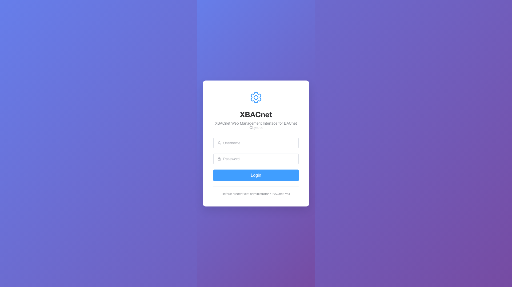

#### 📊 Dashboard
- System overview with real-time statistics
- Interactive charts showing object distribution
- System status monitoring
- Recent activity logs

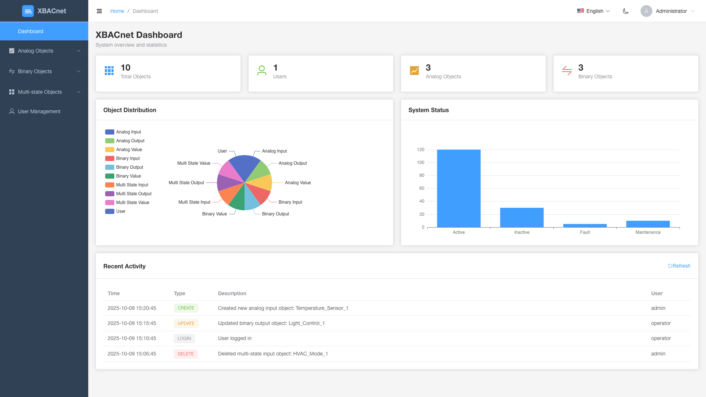

#### 🏗️ BACnet Object Management
Complete CRUD operations for all BACnet object types:

**Analog Objects**
- **Analog Inputs**: Monitor analog input values from sensors
- **Analog Outputs**: Control analog output devices
- **Analog Values**: Store and manage analog values

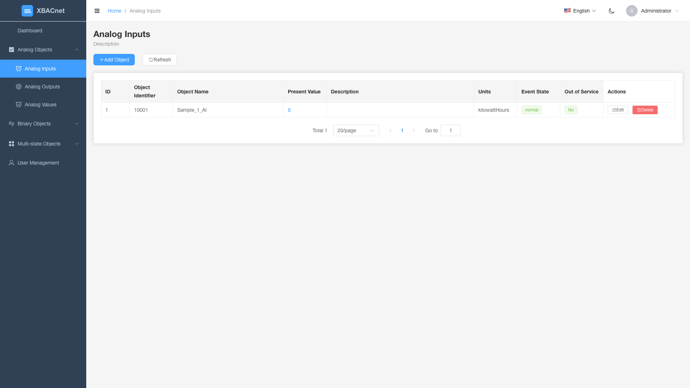
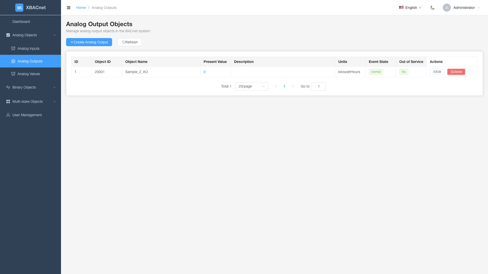
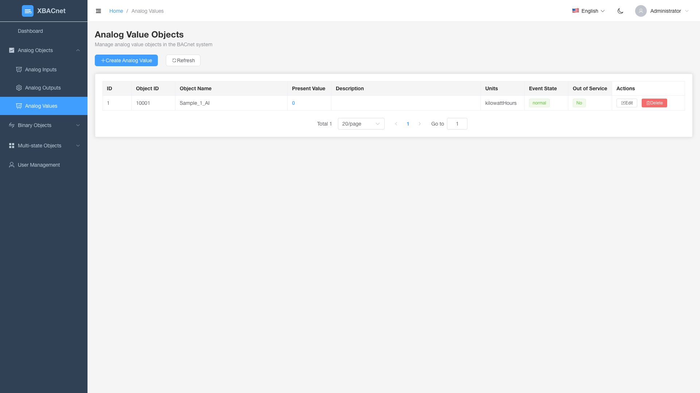

**Binary Objects**
- **Binary Inputs**: Monitor binary input states (on/off)
- **Binary Outputs**: Control binary output devices
- **Binary Values**: Store and manage binary values


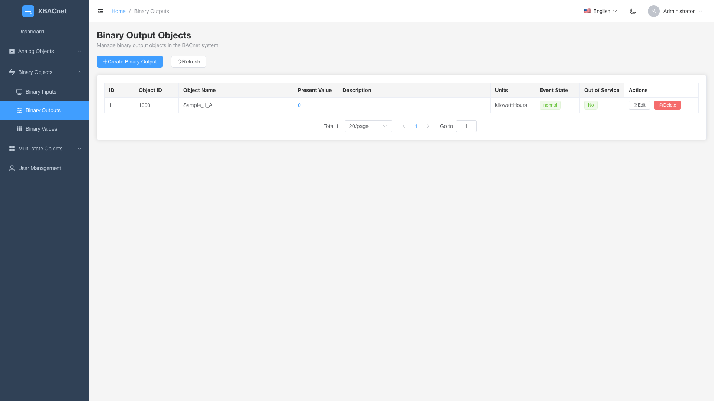
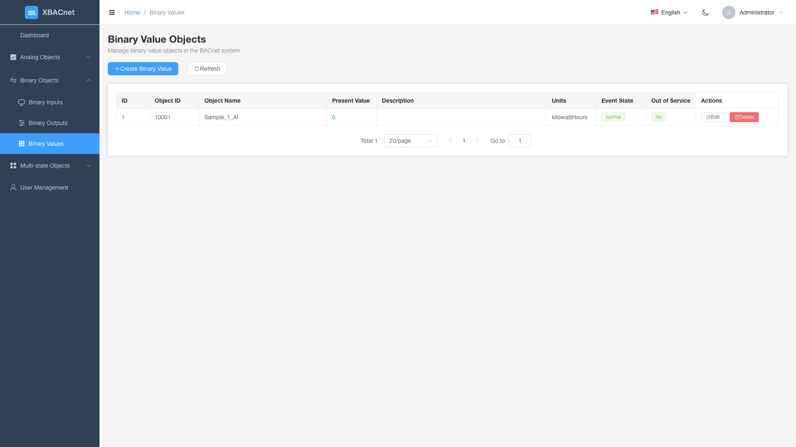

**Multi-state Objects**
- **Multi-state Inputs**: Monitor multi-state input devices
- **Multi-state Outputs**: Control multi-state output devices
- **Multi-state Values**: Store and manage multi-state values

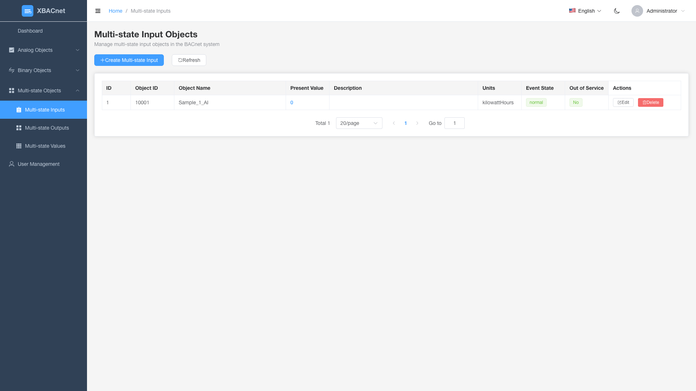
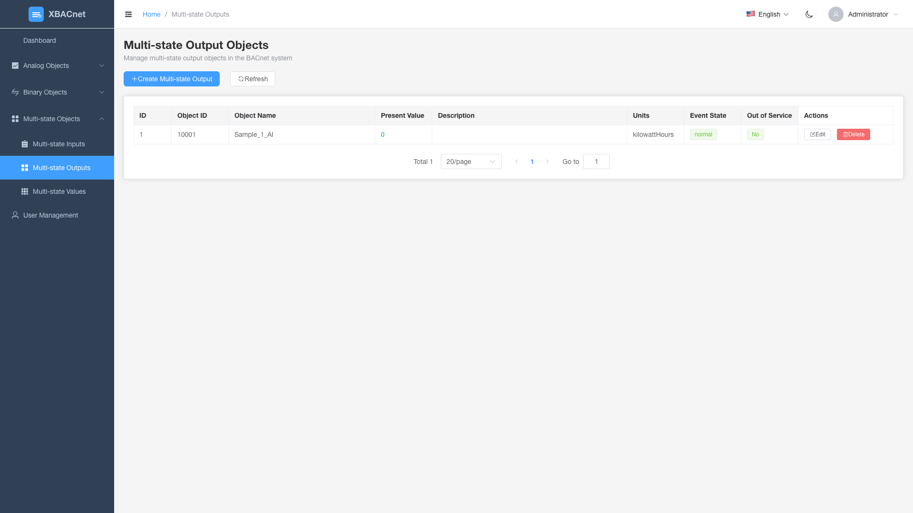
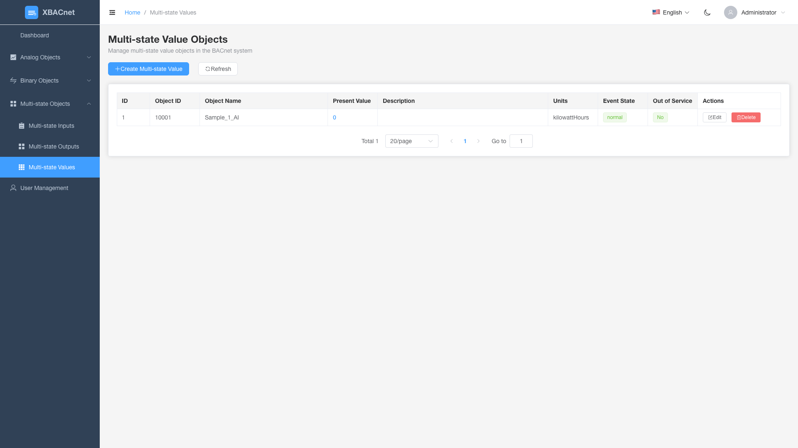

#### 👥 User Management
- Create, edit, and delete user accounts
- Role-based permissions
- User activity tracking

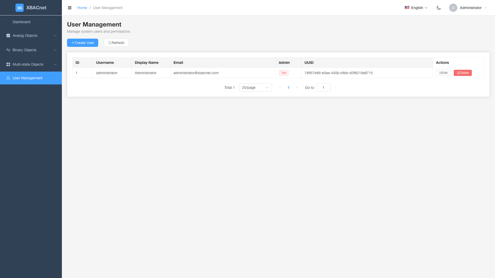

### Quick Start

1. **Start the API Server**
   ```bash
   cd xbacnet-api
   python run.py --port 8000
   ```

2. **Start the Web Interface**
   ```bash
   cd xbacnet-web
   npm install
   npm run dev
   ```

3. **Access the Interface**
   - Open browser to `http://localhost:3000`
   - Login with: `administrator` / `!BACnetPro1`

### Technology Stack
- **Frontend**: Vue 3 + Element Plus + ECharts
- **Backend**: Python Falcon REST API
- **Database**: MySQL
- **Authentication**: JWT-based security


## WeChat Group


