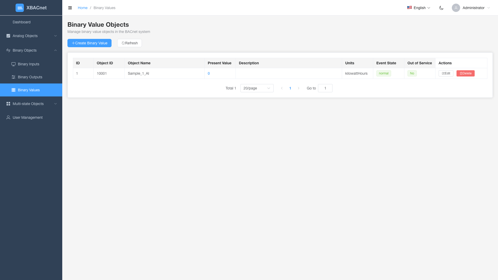

<h1 align="center" style="margin: 30px 0 30px; font-weight: bold;">xBACnet v1.0.0</h1>
<h4 align="center">نشر أي بيانات كـ BACnet</h4>

[简体中文](./README_CN.md) | [English](./README.md) | [Français](./README_FR.md) | [Español](./README_ES.md) | [Русский](./README_RU.md) | [Português](./README_PT.md) | [हिन्दी](./README_HI.md) | [Bahasa Indonesia](./README_ID.md) | [Bahasa Melayu](./README_MS.md) | [Tiếng Việt](./README_VI.md) | [Türkçe](./README_TR.md) | [العربية](./README_AR.md)

## مقدمة xBACnet

xBACnet ينشر أي بيانات كـ BACnet!

هذا التطبيق هو برنامج خادم BACnet يُستخدم لنشر بيانات متنوعة كخدمات أساسية متعددة في شبكة BACnet.
الخدمات المدعومة تشمل Who-Is، I-Am لربط الأجهزة، قراءة/كتابة الخصائص، قراءة/كتابة خصائص متعددة والاشتراك في تغييرات القيم.


## المتطلبات المسبقة
قاعدة بيانات MySQL
Python (3.4 3.5 3.6 3.7 3.8 3.9 3.10)


## التثبيت

* استنساخ الكود المصدري
```
git clone https://gitee.com/xbacnet/xbacnet
```
* إنشاء قاعدة البيانات
```
mysql -u root -p < xbacnet/database/xbacnet.sql
```
* تثبيت التبعيات
```
sudo cp ~/xbacnet/xbacnet-server /xbacnet-server
cd /xbacnet-server
sudo pip install -r requirements.txt
```

* تكوين xbacnet-server

فتح ملف التكوين
تعديل العنوان: lo إلى اسم الواجهة الفعلي بتشغيل 'ip a'
تعديل معرف الكائن
```
$ sudo nano /xbacnet-server/config.ini
```

تحرير ملف إعدادات قاعدة البيانات
```
sudo nano /xbacnet-server/settings.py
```

* فتح منفذ الجدار الناري
```
$ sudo ufw allow 47808
```


### مثال config.ini
```
[BACpypes]
objectName: xBACnet Server
address: 192.168.20.193
objectIdentifier: 20193
description: xBACnet Server
vendorName: xBACnet Inc.
maxApduLengthAccepted: 1024
segmentationSupported: segmentedBoth
vendorIdentifier: 1524
foreignBBMD: 192.168.1.1
foreignTTL: 30
systemStatus: operational
```


* التصحيح
```
$ sudo python3 server.py --debug --ini config.ini
-- استخدم --help للمساعدة
$ sudo python3 server.py --help
```

* نشر xbacnet-server
```
sudo cp /xbacnet-server/xbacnet-server.service /lib/systemd/system/
```

```
sudo systemctl enable xbacnet-server.service
```

```
sudo systemctl start xbacnet-server.service
```

## كيفية الاستخدام
إضافة كائنات في قاعدة البيانات، تحرير خصائص الكائنات، كتابة البيانات المراد نشرها في present_value

## واجهة إدارة الويب

xBACnet يتضمن الآن واجهة إدارة ويب حديثة لتسهيل تكوين ومراقبة كائنات BACnet.

### الميزات

#### 🔐 مصادقة المستخدم
- نظام تسجيل دخول آمن مع تحكم في الوصول قائم على الأدوار
- بيانات الاعتماد الافتراضية: `administrator` / `!BACnetPro1`


#### 📊 لوحة التحكم
- نظرة عامة على النظام مع إحصائيات في الوقت الفعلي
- رسوم بيانية تفاعلية تُظهر توزيع الكائنات
- مراقبة حالة النظام
- سجلات النشاط الأخيرة


#### 🏗️ إدارة كائنات BACnet
عمليات CRUD كاملة لجميع أنواع كائنات BACnet:

**كائنات التناظرية**
- **مدخلات تناظرية**: مراقبة قيم المدخلات التناظرية من أجهزة الاستشعار
- **مخرجات تناظرية**: التحكم في أجهزة المخرجات التناظرية
- **قيم تناظرية**: تخزين وإدارة القيم التناظرية


**كائنات ثنائية**
- **مدخلات ثنائية**: مراقبة حالات المدخلات الثنائية (تشغيل/إيقاف)
- **مخرجات ثنائية**: التحكم في أجهزة المخرجات الثنائية
- **قيم ثنائية**: تخزين وإدارة القيم الثنائية




**كائنات متعددة الحالات**
- **مدخلات متعددة الحالات**: مراقبة أجهزة المدخلات متعددة الحالات
- **مخرجات متعددة الحالات**: التحكم في أجهزة المخرجات متعددة الحالات
- **قيم متعددة الحالات**: تخزين وإدارة القيم متعددة الحالات


#### 👥 إدارة المستخدمين
- إنشاء وتحرير وحذف حسابات المستخدمين
- أذونات قائمة على الأدوار
- تتبع نشاط المستخدم


### البدء السريع

1. **بدء خادم API**
   ```bash
   cd xbacnet-api
   python run.py --port 8000
   ```

2. **بدء واجهة الويب**
   ```bash
   cd xbacnet-web
   npm install
   npm run dev
   ```

3. **الوصول إلى الواجهة**
   - فتح المتصفح على `http://localhost:3000`
   - تسجيل الدخول باستخدام: `administrator` / `!BACnetPro1`

### المكدس التقني
- **الواجهة الأمامية**: Vue 3 + Element Plus + ECharts
- **الخلفية**: Python Falcon REST API
- **قاعدة البيانات**: MySQL
- **المصادقة**: أمان قائم على JWT

## مجموعة WeChat


