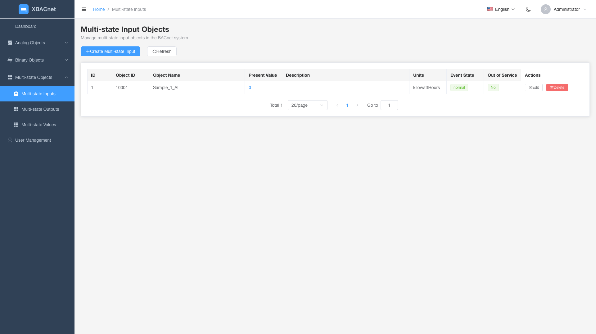

<h1 align="center" style="margin: 30px 0 30px; font-weight: bold;">xBACnet v1.0.0</h1>
<h4 align="center">把任何数据发布为BACnet</h4>

[简体中文](./README_CN.md) | [English](./README.md) | [Français](./README_FR.md) | [Español](./README_ES.md) | [Русский](./README_RU.md) | [Português](./README_PT.md) | [हिन्दी](./README_HI.md) | [Bahasa Indonesia](./README_ID.md) | [Bahasa Melayu](./README_MS.md) | [Tiếng Việt](./README_VI.md) | [Türkçe](./README_TR.md) | [العربية](./README_AR.md)

## xBACnet 介绍

xBACnet把任何数据发布为BACnet!

此应用是一个BACnet服务器软件，用于在BACnet网络中把各种数据数据发布为多种核心服务。
支持的服务有Who-Is、I-Am用于设备绑定，读写属性，读写多属性和值变化订阅。


## 前提
MySQL数据库
Python (3.4 3.5 3.6 3.7 3.8 3.9 3.10)


## 安装

* 克隆源代码
```
git clone https://gitee.com/xbacnet/xbacnet
```
* 创建数据库
```
mysql -u root -p < xbacnet/database/xbacnet.sql
```
* 安装依赖库
```
sudo cp ~/xbacnet/xbacnet-server /xbacnet-server
cd /xbacnet-server
sudo pip install -r requirements.txt
```

* 配置xbacnet-server

打开配置文件
修改地址 Modify address: lo to the actual interface name by running 'ip a'
修改对象ID
```
$ sudo nano /xbacnet-server/config.ini
```

编辑数据库设置文件
```
sudo nano /xbacnet-server/settings.py
```

* 打开防火墙端口
```
$ sudo ufw allow 47808
```


### 示例config.ini
```
[BACpypes]
objectName: xBACnet Server
address: 192.168.20.193
objectIdentifier: 20193
description: xBACnet Server
vendorName: xBACnet Inc.
maxApduLengthAccepted: 1024
segmentationSupported: segmentedBoth
vendorIdentifier: 1524
foreignBBMD: 192.168.1.1
foreignTTL: 30
systemStatus: operational
```


* 调试
```
$ sudo python3 server.py --debug --ini config.ini
-- Use --help for help
$ sudo python3 server.py --help
```

* 部署xbacnet-server
```
sudo cp /xbacnet-server/xbacnet-server.service /lib/systemd/system/
```

```
sudo systemctl enable xbacnet-server.service
```

```
sudo systemctl start xbacnet-server.service
```

* 如何使用
在数据库中的添加对象，编辑对象属性，把要发布的数据写入present_value

## Web管理界面

xBACnet现在包含一个现代化的基于Web的管理界面，用于轻松配置和监控BACnet对象。

### 功能特性

#### 🔐 用户认证
- 安全的登录系统，支持基于角色的访问控制
- 默认凭据：`administrator` / `!BACnetPro1`


#### 📊 仪表板
- 系统概览和实时统计信息
- 显示对象分布情况的交互式图表
- 系统状态监控
- 最近活动日志


#### 🏗️ BACnet对象管理
支持所有BACnet对象类型的完整CRUD操作：

**模拟对象**
- **模拟输入**：监控传感器的模拟输入值
- **模拟输出**：控制模拟输出设备
- **模拟值**：存储和管理模拟值


**二进制对象**
- **二进制输入**：监控二进制输入状态（开/关）
- **二进制输出**：控制二进制输出设备
- **二进制值**：存储和管理二进制值


**多状态对象**
- **多状态输入**：监控多状态输入设备
- **多状态输出**：控制多状态输出设备
- **多状态值**：存储和管理多状态值




#### 👥 用户管理
- 创建、编辑和删除用户账户
- 基于角色的权限管理
- 用户活动跟踪


### 快速开始

1. **启动API服务器**
   ```bash
   cd xbacnet-api
   python run.py --port 8000
   ```

2. **启动Web界面**
   ```bash
   cd xbacnet-web
   npm install
   npm run dev
   ```

3. **访问界面**
   - 打开浏览器访问 `http://localhost:3000`
   - 使用 `administrator` / `!BACnetPro1` 登录

### 技术栈
- **前端**：Vue 3 + Element Plus + ECharts
- **后端**：Python Falcon REST API
- **数据库**：MySQL
- **认证**：基于JWT的安全认证


## 微信群


