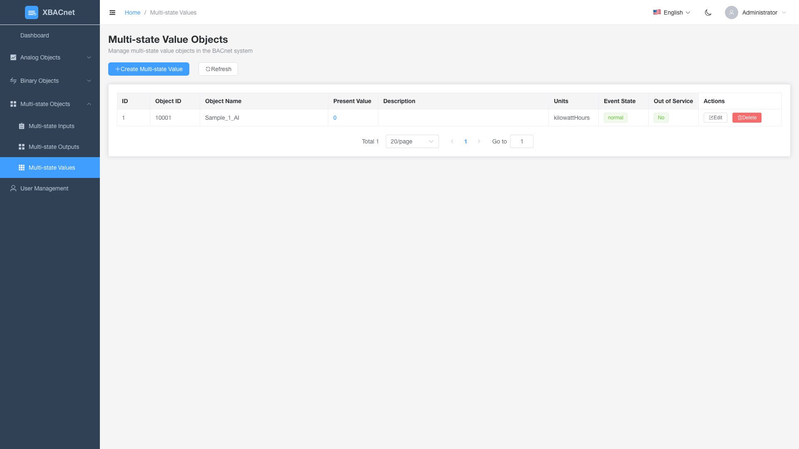

<h1 align="center" style="margin: 30px 0 30px; font-weight: bold;">xBACnet v1.0.0</h1>
<h4 align="center">Publicar cualquier dato como BACnet</h4>

[简体中文](./README_CN.md) | [English](./README.md) | [Français](./README_FR.md) | [Español](./README_ES.md) | [Русский](./README_RU.md) | [Português](./README_PT.md) | [हिन्दी](./README_HI.md) | [Bahasa Indonesia](./README_ID.md) | [Bahasa Melayu](./README_MS.md) | [Tiếng Việt](./README_VI.md) | [Türkçe](./README_TR.md) | [العربية](./README_AR.md)

## Introducción xBACnet

¡xBACnet publica cualquier dato como BACnet!

Esta aplicación es un software servidor BACnet utilizado para publicar varios datos como múltiples servicios principales en una red BACnet.
Los servicios soportados incluyen Who-Is, I-Am para vinculación de dispositivos, lectura/escritura de propiedades, lectura/escritura de propiedades múltiples y suscripción a cambios de valor.


## Prerrequisitos
Base de datos MySQL
Python (3.4 3.5 3.6 3.7 3.8 3.9 3.10)


## Instalación

* Clonar el código fuente
```
git clone https://gitee.com/xbacnet/xbacnet
```
* Crear la base de datos
```
mysql -u root -p < xbacnet/database/xbacnet.sql
```
* Instalar dependencias
```
sudo cp ~/xbacnet/xbacnet-server /xbacnet-server
cd /xbacnet-server
sudo pip install -r requirements.txt
```

* Configurar xbacnet-server

Abrir el archivo de configuración
Modificar la dirección: lo al nombre de interfaz real ejecutando 'ip a'
Modificar el ID del objeto
```
$ sudo nano /xbacnet-server/config.ini
```

Editar el archivo de configuración de la base de datos
```
sudo nano /xbacnet-server/settings.py
```

* Abrir el puerto del firewall
```
$ sudo ufw allow 47808
```


### Ejemplo config.ini
```
[BACpypes]
objectName: xBACnet Server
address: 192.168.20.193
objectIdentifier: 20193
description: xBACnet Server
vendorName: xBACnet Inc.
maxApduLengthAccepted: 1024
segmentationSupported: segmentedBoth
vendorIdentifier: 1524
foreignBBMD: 192.168.1.1
foreignTTL: 30
systemStatus: operational
```


* Depuración
```
$ sudo python3 server.py --debug --ini config.ini
-- Usar --help para ayuda
$ sudo python3 server.py --help
```

* Desplegar xbacnet-server
```
sudo cp /xbacnet-server/xbacnet-server.service /lib/systemd/system/
```

```
sudo systemctl enable xbacnet-server.service
```

```
sudo systemctl start xbacnet-server.service
```

## Cómo usar
Agregar objetos en la base de datos, editar propiedades de objetos, escribir los datos a publicar en present_value

## Interfaz de Gestión Web

xBACnet ahora incluye una interfaz de gestión web moderna para facilitar la configuración y monitoreo de objetos BACnet.

### Características

#### 🔐 Autenticación de Usuario
- Sistema de inicio de sesión seguro con control de acceso basado en roles
- Credenciales por defecto: `administrator` / `!BACnetPro1`


#### 📊 Panel de Control
- Resumen del sistema con estadísticas en tiempo real
- Gráficos interactivos mostrando distribución de objetos
- Monitoreo del estado del sistema
- Registros de actividad reciente


#### 🏗️ Gestión de Objetos BACnet
Operaciones CRUD completas para todos los tipos de objetos BACnet:

**Objetos Analógicos**
- **Entradas Analógicas**: Monitorear valores de entrada analógica de sensores
- **Salidas Analógicas**: Controlar dispositivos de salida analógica
- **Valores Analógicos**: Almacenar y gestionar valores analógicos


**Objetos Binarios**
- **Entradas Binarias**: Monitorear estados de entrada binaria (encendido/apagado)
- **Salidas Binarias**: Controlar dispositivos de salida binaria
- **Valores Binarios**: Almacenar y gestionar valores binarios


**Objetos Multi-estado**
- **Entradas Multi-estado**: Monitorear dispositivos de entrada multi-estado
- **Salidas Multi-estado**: Controlar dispositivos de salida multi-estado
- **Valores Multi-estado**: Almacenar y gestionar valores multi-estado




#### 👥 Gestión de Usuarios
- Crear, editar y eliminar cuentas de usuario
- Permisos basados en roles
- Seguimiento de actividad del usuario


### Inicio Rápido

1. **Iniciar el Servidor API**
   ```bash
   cd xbacnet-api
   python run.py --port 8000
   ```

2. **Iniciar la Interfaz Web**
   ```bash
   cd xbacnet-web
   npm install
   npm run dev
   ```

3. **Acceder a la Interfaz**
   - Abrir navegador en `http://localhost:3000`
   - Iniciar sesión con: `administrator` / `!BACnetPro1`

### Stack Tecnológico
- **Frontend**: Vue 3 + Element Plus + ECharts
- **Backend**: Python Falcon REST API
- **Base de Datos**: MySQL
- **Autenticación**: Seguridad basada en JWT

## Grupo WeChat


