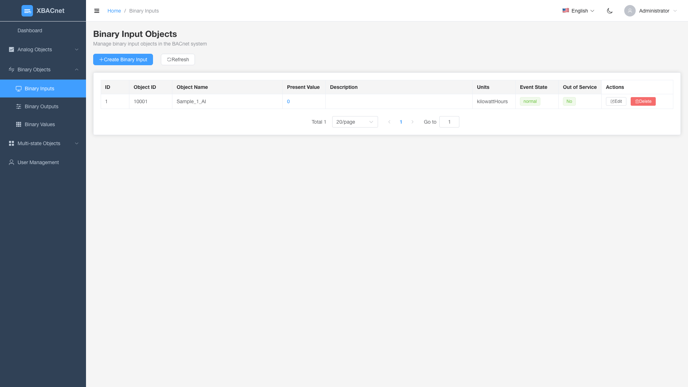

<h1 align="center" style="margin: 30px 0 30px; font-weight: bold;">xBACnet v1.0.0</h1>
<h4 align="center">किसी भी डेटा को BACnet के रूप में प्रकाशित करें</h4>

[简体中文](./README_CN.md) | [English](./README.md) | [Français](./README_FR.md) | [Español](./README_ES.md) | [Русский](./README_RU.md) | [Português](./README_PT.md) | [हिन्दी](./README_HI.md) | [Bahasa Indonesia](./README_ID.md) | [Bahasa Melayu](./README_MS.md) | [Tiếng Việt](./README_VI.md) | [Türkçe](./README_TR.md) | [العربية](./README_AR.md)

## xBACnet का परिचय

xBACnet किसी भी डेटा को BACnet के रूप में प्रकाशित करता है!

यह एप्लिकेशन एक BACnet सर्वर सॉफ्टवेयर है जिसका उपयोग BACnet नेटवर्क में विभिन्न डेटा को कई मुख्य सेवाओं के रूप में प्रकाशित करने के लिए किया जाता है।
समर्थित सेवाओं में Who-Is, I-Am डिवाइस बाइंडिंग के लिए, गुण पढ़ना/लिखना, कई गुण पढ़ना/लिखना और मूल्य परिवर्तन सब्सक्रिप्शन शामिल हैं।


## आवश्यकताएं
MySQL डेटाबेस
Python (3.4 3.5 3.6 3.7 3.8 3.9 3.10)


## स्थापना

* स्रोत कोड क्लोन करें
```
git clone https://gitee.com/xbacnet/xbacnet
```
* डेटाबेस बनाएं
```
mysql -u root -p < xbacnet/database/xbacnet.sql
```
* निर्भरताएं स्थापित करें
```
sudo cp ~/xbacnet/xbacnet-server /xbacnet-server
cd /xbacnet-server
sudo pip install -r requirements.txt
```

* xbacnet-server कॉन्फ़िगर करें

कॉन्फ़िगरेशन फ़ाइल खोलें
पता संशोधित करें: 'ip a' चलाकर lo को वास्तविक इंटरफ़ेस नाम में बदलें
ऑब्जेक्ट ID संशोधित करें
```
$ sudo nano /xbacnet-server/config.ini
```

डेटाबेस सेटिंग्स फ़ाइल संपादित करें
```
sudo nano /xbacnet-server/settings.py
```

* फ़ायरवॉल पोर्ट खोलें
```
$ sudo ufw allow 47808
```


### उदाहरण config.ini
```
[BACpypes]
objectName: xBACnet Server
address: 192.168.20.193
objectIdentifier: 20193
description: xBACnet Server
vendorName: xBACnet Inc.
maxApduLengthAccepted: 1024
segmentationSupported: segmentedBoth
vendorIdentifier: 1524
foreignBBMD: 192.168.1.1
foreignTTL: 30
systemStatus: operational
```


* डिबगिंग
```
$ sudo python3 server.py --debug --ini config.ini
-- सहायता के लिए --help का उपयोग करें
$ sudo python3 server.py --help
```

* xbacnet-server तैनात करें
```
sudo cp /xbacnet-server/xbacnet-server.service /lib/systemd/system/
```

```
sudo systemctl enable xbacnet-server.service
```

```
sudo systemctl start xbacnet-server.service
```

## कैसे उपयोग करें
डेटाबेस में ऑब्जेक्ट जोड़ें, ऑब्जेक्ट गुण संपादित करें, प्रकाशित करने के लिए डेटा को present_value में लिखें

## वेब प्रबंधन इंटरफ़ेस

xBACnet अब BACnet ऑब्जेक्ट्स के आसान कॉन्फ़िगरेशन और मॉनिटरिंग के लिए एक आधुनिक वेब-आधारित प्रबंधन इंटरफ़ेस शामिल करता है।

### सुविधाएं

#### 🔐 उपयोगकर्ता प्रमाणीकरण
- भूमिका-आधारित पहुंच नियंत्रण के साथ सुरक्षित लॉगिन सिस्टम
- डिफ़ॉल्ट क्रेडेंशियल: `administrator` / `!BACnetPro1`


#### 📊 डैशबोर्ड
- वास्तविक समय सांख्यिकी के साथ सिस्टम अवलोकन
- ऑब्जेक्ट वितरण दिखाने वाले इंटरैक्टिव चार्ट
- सिस्टम स्थिति मॉनिटरिंग
- हाल की गतिविधि लॉग


#### 🏗️ BACnet ऑब्जेक्ट प्रबंधन
सभी BACnet ऑब्जेक्ट प्रकारों के लिए पूर्ण CRUD संचालन:

**एनालॉग ऑब्जेक्ट्स**
- **एनालॉग इनपुट्स**: सेंसर से एनालॉग इनपुट मानों की निगरानी
- **एनालॉग आउटपुट्स**: एनालॉग आउटपुट डिवाइस को नियंत्रित करना
- **एनालॉग वैल्यूज़**: एनालॉग मानों को स्टोर और प्रबंधित करना


**बाइनरी ऑब्जेक्ट्स**
- **बाइनरी इनपुट्स**: बाइनरी इनपुट स्थितियों की निगरानी (चालू/बंद)
- **बाइनरी आउटपुट्स**: बाइनरी आउटपुट डिवाइस को नियंत्रित करना
- **बाइनरी वैल्यूज़**: बाइनरी मानों को स्टोर और प्रबंधित करना




**मल्टी-स्टेट ऑब्जेक्ट्स**
- **मल्टी-स्टेट इनपुट्स**: मल्टी-स्टेट इनपुट डिवाइस की निगरानी
- **मल्टी-स्टेट आउटपुट्स**: मल्टी-स्टेट आउटपुट डिवाइस को नियंत्रित करना
- **मल्टी-स्टेट वैल्यूज़**: मल्टी-स्टेट मानों को स्टोर और प्रबंधित करना


#### 👥 उपयोगकर्ता प्रबंधन
- उपयोगकर्ता खाते बनाना, संपादित करना और हटाना
- भूमिका-आधारित अनुमतियां
- उपयोगकर्ता गतिविधि ट्रैकिंग


### त्वरित प्रारंभ

1. **API सर्वर शुरू करें**
   ```bash
   cd xbacnet-api
   python run.py --port 8000
   ```

2. **वेब इंटरफ़ेस शुरू करें**
   ```bash
   cd xbacnet-web
   npm install
   npm run dev
   ```

3. **इंटरफ़ेस तक पहुंचें**
   - ब्राउज़र में `http://localhost:3000` खोलें
   - लॉगिन करें: `administrator` / `!BACnetPro1`

### तकनीकी स्टैक
- **फ्रंटएंड**: Vue 3 + Element Plus + ECharts
- **बैकएंड**: Python Falcon REST API
- **डेटाबेस**: MySQL
- **प्रमाणीकरण**: JWT-आधारित सुरक्षा

## WeChat समूह


