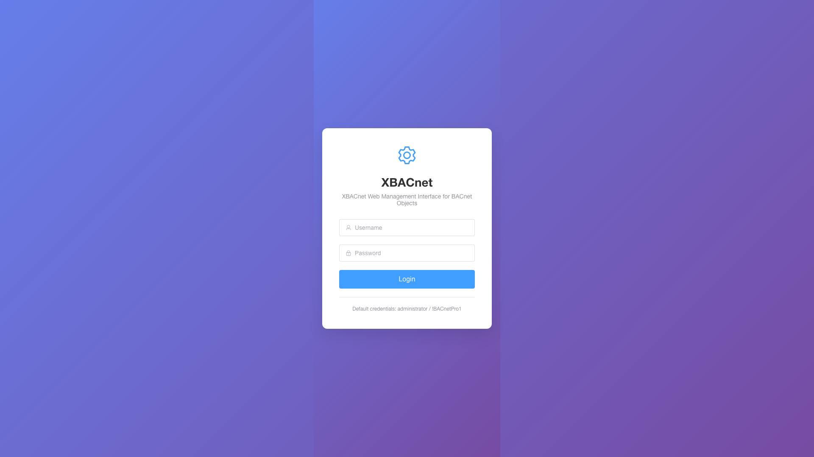
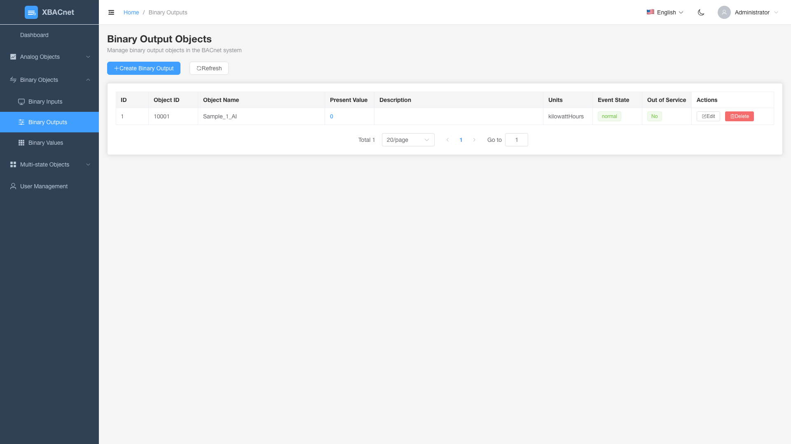
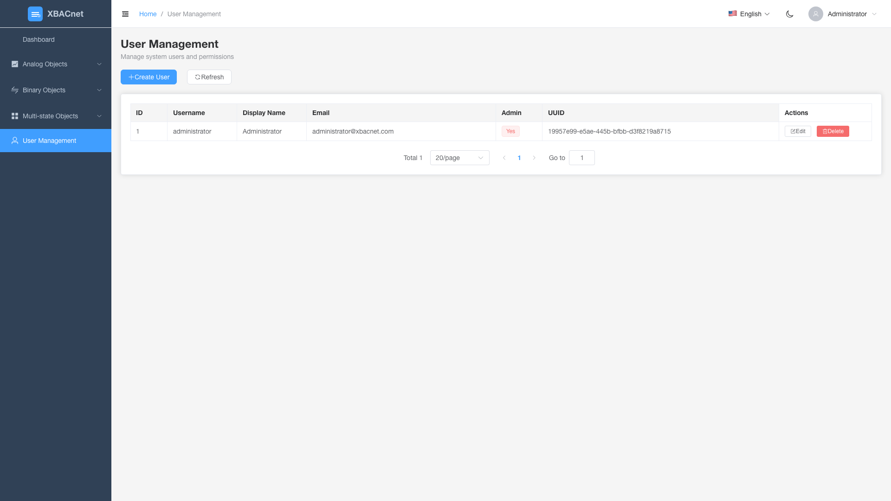

<h1 align="center" style="margin: 30px 0 30px; font-weight: bold;">xBACnet v1.0.0</h1>
<h4 align="center">Publikasikan data apa pun sebagai BACnet</h4>

[简体中文](./README_CN.md) | [English](./README.md) | [Français](./README_FR.md) | [Español](./README_ES.md) | [Русский](./README_RU.md) | [Português](./README_PT.md) | [हिन्दी](./README_HI.md) | [Bahasa Indonesia](./README_ID.md) | [Bahasa Melayu](./README_MS.md) | [Tiếng Việt](./README_VI.md) | [Türkçe](./README_TR.md) | [العربية](./README_AR.md)

## Pengenalan xBACnet

xBACnet mempublikasikan data apa pun sebagai BACnet!

Aplikasi ini adalah perangkat lunak server BACnet yang digunakan untuk mempublikasikan berbagai data sebagai beberapa layanan inti dalam jaringan BACnet.
Layanan yang didukung termasuk Who-Is, I-Am untuk pengikatan perangkat, membaca/menulis properti, membaca/menulis properti ganda dan berlangganan perubahan nilai.


## Prasyarat
Database MySQL
Python (3.4 3.5 3.6 3.7 3.8 3.9 3.10)


## Instalasi

* Kloning kode sumber
```
git clone https://gitee.com/xbacnet/xbacnet
```
* Buat database
```
mysql -u root -p < xbacnet/database/xbacnet.sql
```
* Instal dependensi
```
sudo cp ~/xbacnet/xbacnet-server /xbacnet-server
cd /xbacnet-server
sudo pip install -r requirements.txt
```

* Konfigurasi xbacnet-server

Buka file konfigurasi
Ubah alamat: lo ke nama antarmuka yang sebenarnya dengan menjalankan 'ip a'
Ubah ID objek
```
$ sudo nano /xbacnet-server/config.ini
```

Edit file pengaturan database
```
sudo nano /xbacnet-server/settings.py
```

* Buka port firewall
```
$ sudo ufw allow 47808
```


### Contoh config.ini
```
[BACpypes]
objectName: xBACnet Server
address: 192.168.20.193
objectIdentifier: 20193
description: xBACnet Server
vendorName: xBACnet Inc.
maxApduLengthAccepted: 1024
segmentationSupported: segmentedBoth
vendorIdentifier: 1524
foreignBBMD: 192.168.1.1
foreignTTL: 30
systemStatus: operational
```


* Debugging
```
$ sudo python3 server.py --debug --ini config.ini
-- Gunakan --help untuk bantuan
$ sudo python3 server.py --help
```

* Deploy xbacnet-server
```
sudo cp /xbacnet-server/xbacnet-server.service /lib/systemd/system/
```

```
sudo systemctl enable xbacnet-server.service
```

```
sudo systemctl start xbacnet-server.service
```

## Cara menggunakan
Tambahkan objek dalam database, edit properti objek, tulis data yang akan dipublikasikan ke present_value

## Antarmuka Manajemen Web

xBACnet sekarang menyertakan antarmuka manajemen web modern untuk memudahkan konfigurasi dan pemantauan objek BACnet.

### Fitur

#### 🔐 Autentikasi Pengguna
- Sistem login aman dengan kontrol akses berbasis peran
- Kredensial default: `administrator` / `!BACnetPro1`



#### 📊 Dashboard
- Ringkasan sistem dengan statistik real-time
- Grafik interaktif menampilkan distribusi objek
- Pemantauan status sistem
- Log aktivitas terbaru


#### 🏗️ Manajemen Objek BACnet
Operasi CRUD lengkap untuk semua jenis objek BACnet:

**Objek Analog**
- **Input Analog**: Memantau nilai input analog dari sensor
- **Output Analog**: Mengontrol perangkat output analog
- **Nilai Analog**: Menyimpan dan mengelola nilai analog


**Objek Biner**
- **Input Biner**: Memantau status input biner (hidup/mati)
- **Output Biner**: Mengontrol perangkat output biner
- **Nilai Biner**: Menyimpan dan mengelola nilai biner





**Objek Multi-state**
- **Input Multi-state**: Memantau perangkat input multi-state
- **Output Multi-state**: Mengontrol perangkat output multi-state
- **Nilai Multi-state**: Menyimpan dan mengelola nilai multi-state


#### 👥 Manajemen Pengguna
- Membuat, mengedit, dan menghapus akun pengguna
- Izin berbasis peran
- Pelacakan aktivitas pengguna



### Mulai Cepat

1. **Mulai Server API**
   ```bash
   cd xbacnet-api
   python run.py --port 8000
   ```

2. **Mulai Antarmuka Web**
   ```bash
   cd xbacnet-web
   npm install
   npm run dev
   ```

3. **Akses Antarmuka**
   - Buka browser ke `http://localhost:3000`
   - Login dengan: `administrator` / `!BACnetPro1`

### Stack Teknologi
- **Frontend**: Vue 3 + Element Plus + ECharts
- **Backend**: Python Falcon REST API
- **Database**: MySQL
- **Autentikasi**: Keamanan berbasis JWT

## Grup WeChat


