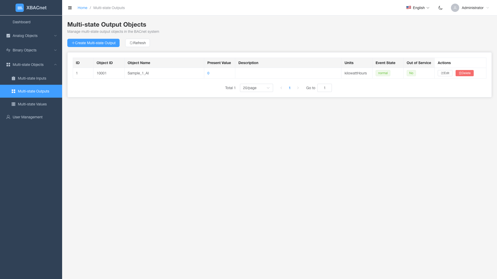

<h1 align="center" style="margin: 30px 0 30px; font-weight: bold;">xBACnet v1.0.0</h1>
<h4 align="center">Terbitkan sebarang data sebagai BACnet</h4>

[简体中文](./README_CN.md) | [English](./README.md) | [Français](./README_FR.md) | [Español](./README_ES.md) | [Русский](./README_RU.md) | [Português](./README_PT.md) | [हिन्दी](./README_HI.md) | [Bahasa Indonesia](./README_ID.md) | [Bahasa Melayu](./README_MS.md) | [Tiếng Việt](./README_VI.md) | [Türkçe](./README_TR.md) | [العربية](./README_AR.md)

## Pengenalan xBACnet

xBACnet menerbitkan sebarang data sebagai BACnet!

Aplikasi ini adalah perisian pelayan BACnet yang digunakan untuk menerbitkan pelbagai data sebagai pelbagai perkhidmatan teras dalam rangkaian BACnet.
Perkhidmatan yang disokong termasuk Who-Is, I-Am untuk pengikatan peranti, membaca/menulis sifat, membaca/menulis sifat berganda dan langganan perubahan nilai.


## Prasyarat
Pangkalan data MySQL
Python (3.4 3.5 3.6 3.7 3.8 3.9 3.10)


## Pemasangan

* Klon kod sumber
```
git clone https://gitee.com/xbacnet/xbacnet
```
* Cipta pangkalan data
```
mysql -u root -p < xbacnet/database/xbacnet.sql
```
* Pasang kebergantungan
```
sudo cp ~/xbacnet/xbacnet-server /xbacnet-server
cd /xbacnet-server
sudo pip install -r requirements.txt
```

* Konfigurasi xbacnet-server

Buka fail konfigurasi
Ubah alamat: lo kepada nama antara muka sebenar dengan menjalankan 'ip a'
Ubah ID objek
```
$ sudo nano /xbacnet-server/config.ini
```

Edit fail tetapan pangkalan data
```
sudo nano /xbacnet-server/settings.py
```

* Buka port firewall
```
$ sudo ufw allow 47808
```


### Contoh config.ini
```
[BACpypes]
objectName: xBACnet Server
address: 192.168.20.193
objectIdentifier: 20193
description: xBACnet Server
vendorName: xBACnet Inc.
maxApduLengthAccepted: 1024
segmentationSupported: segmentedBoth
vendorIdentifier: 1524
foreignBBMD: 192.168.1.1
foreignTTL: 30
systemStatus: operational
```


* Penyahpepijat
```
$ sudo python3 server.py --debug --ini config.ini
-- Gunakan --help untuk bantuan
$ sudo python3 server.py --help
```

* Deploy xbacnet-server
```
sudo cp /xbacnet-server/xbacnet-server.service /lib/systemd/system/
```

```
sudo systemctl enable xbacnet-server.service
```

```
sudo systemctl start xbacnet-server.service
```

## Cara menggunakan
Tambah objek dalam pangkalan data, edit sifat objek, tulis data yang akan diterbitkan ke present_value

## Antara Muka Pengurusan Web

xBACnet kini merangkumi antara muka pengurusan web moden untuk memudahkan konfigurasi dan pemantauan objek BACnet.

### Ciri-ciri

#### 🔐 Pengesahan Pengguna
- Sistem log masuk selamat dengan kawalan akses berasaskan peranan
- Kredensial lalai: `administrator` / `!BACnetPro1`


#### 📊 Papan Pemuka
- Gambaran keseluruhan sistem dengan statistik masa nyata
- Carta interaktif menunjukkan taburan objek
- Pemantauan status sistem
- Log aktiviti terkini


#### 🏗️ Pengurusan Objek BACnet
Operasi CRUD lengkap untuk semua jenis objek BACnet:

**Objek Analog**
- **Input Analog**: Pantau nilai input analog dari sensor
- **Output Analog**: Kawal peranti output analog
- **Nilai Analog**: Simpan dan urus nilai analog


**Objek Binari**
- **Input Binari**: Pantau status input binari (hidup/mati)
- **Output Binari**: Kawal peranti output binari
- **Nilai Binari**: Simpan dan urus nilai binari


**Objek Multi-keadaan**
- **Input Multi-keadaan**: Pantau peranti input multi-keadaan
- **Output Multi-keadaan**: Kawal peranti output multi-keadaan
- **Nilai Multi-keadaan**: Simpan dan urus nilai multi-keadaan





#### 👥 Pengurusan Pengguna
- Cipta, edit dan padam akaun pengguna
- Kebenaran berasaskan peranan
- Penjejak aktiviti pengguna


### Permulaan Pantas

1. **Mulakan Pelayan API**
   ```bash
   cd xbacnet-api
   python run.py --port 8000
   ```

2. **Mulakan Antara Muka Web**
   ```bash
   cd xbacnet-web
   npm install
   npm run dev
   ```

3. **Akses Antara Muka**
   - Buka pelayar ke `http://localhost:3000`
   - Log masuk dengan: `administrator` / `!BACnetPro1`

### Stack Teknologi
- **Frontend**: Vue 3 + Element Plus + ECharts
- **Backend**: Python Falcon REST API
- **Pangkalan Data**: MySQL
- **Pengesahan**: Keselamatan berasaskan JWT

## Kumpulan WeChat


